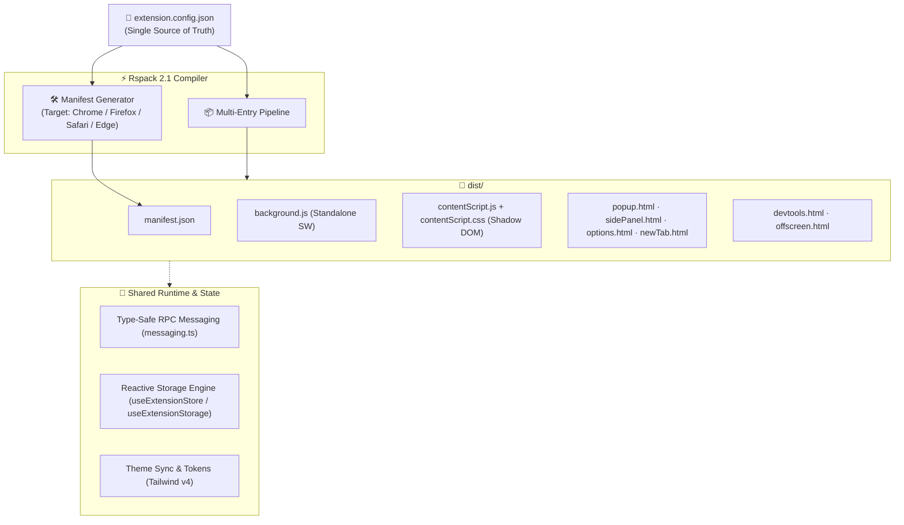

<div align="center">

# ⚡ CRXKit

**The High-Performance, Config-Driven Framework for Modern Cross-Browser Extensions**

[](https://github.com/zh30/crxkit/actions)
[](https://opensource.org/licenses/MIT)
[](https://nodejs.org)
[](https://www.typescriptlang.org/)
[](https://rspack.dev/)
[](https://react.dev/)
[](https://tailwindcss.com/)
[](https://playwright.dev/)

<p align="center">
  A production-grade, battle-tested scaffold and toolkit for developing Chrome Manifest V3, Firefox, Safari, and Edge extensions. Powered by Rspack, React 19, Tailwind CSS v4, shadcn primitives, Zustand, and an extensible CLI.
</p>

</div>

---

## 📑 Table of Contents

- [Overview & Highlights](#-overview--highlights)
- [Architecture](#-architecture)
- [Quick Start](#-quick-start)
- [Project Layout](#-project-layout)
- [Configuration Reference](#-configuration-reference)
- [Core Concepts & Guides](#-core-concepts--guides)
  - [Type-Safe RPC Messaging](#1-type-safe-rpc-messaging)
  - [Reactive Multi-Area Storage Engine](#2-reactive-multi-area-storage-engine)
  - [Shadow DOM Content Script with Tailwind CSS](#3-shadow-dom-content-script-with-tailwind-css)
  - [MV3 Offscreen Documents & Background Automation](#4-mv3-offscreen-documents--background-automation)
  - [Declarative Context Menus & Global Commands](#5-declarative-context-menus--global-commands)
- [CLI Reference](#-cli-reference)
- [Cross-Browser Compilation](#-cross-browser-compilation)
- [Testing & Quality Assurance](#-testing--quality-assurance)
- [Development Commands](#-development-commands)
- [Contributing](#-contributing)
- [License](#-license)

---

## 🌟 Overview & Highlights

Developing browser extensions often involves navigating fragmented APIs across browsers, manual `manifest.json` synchronizations, complex multi-entry bundling configurations, and tedious cross-context state handling.

**CRXKit** solves these challenges by treating `extension.config.json` as the **Single Source of Truth** for the entire extension lifecycle:

- 🚀 **Sub-Second Rspack Bundling**: Rust-powered Rspack build engine with SWC loader, producing optimized builds in under **0.4s**.
- 🌐 **True Cross-Browser Support**: Write once, compile to **Chrome (MV3)**, **Firefox (Gecko MV2/MV3)**, **Safari**, and **Edge**.
- 🛡️ **Zero-CSS-Leak Content Scripts**: React 19 content scripts rendered inside an isolated **Shadow DOM** with Tailwind CSS v4 styling.
- ⚡ **End-to-End Type-Safe RPC**: Bidirectional request/response passing with timeout safeguards and error propagation across Background, Content Scripts, Popup, and Side Panels.
- 💾 **Reactive Multi-Area Storage**: Unified `sync`, `local`, `session`, and `managed` storage with the reactive `useExtensionStorage` React Hook.
- 🧩 **Complete MV3 Entity Coverage**: Out-of-the-box support for `popup`, `side-panel`, `options`, `new-tab`, `devtools`, `offscreen`, `injected` (main-world), and `declarativeNetRequest`.
- 🩺 **Built-in CLI & Compliance Doctor**: Run `pnpm crx doctor` for static health checks, manifest validation, icon verification, and least-privilege permission auditing.
- 🧪 **Enterprise Test Suite**: Unit tests via Vitest with full `chrome.*` mocks, plus real-browser extension sideload testing via Playwright.

---

## 🏗️ Architecture



---

## 🚀 Quick Start

### Prerequisites

- **Node.js** >= 22.0.0
- **Package Manager**: `pnpm` >= 9.0.0

### 1. Clone and Install Dependencies

```bash
git clone https://github.com/zh30/crxkit.git my-extension
cd my-extension
pnpm install
```

### 2. Start Development Mode

```bash
pnpm dev
```
Rspack will watch the source files and compile the extension artifacts into `dist/`.

### 3. Load the Extension in Your Browser

- **Chrome / Edge / Brave / Arc**:
  1. Open `chrome://extensions` (or `edge://extensions`).
  2. Enable **Developer mode** in the top right corner.
  3. Click **Load unpacked** and select the `dist/` directory.
- **Firefox**:
  1. Open `about:debugging#/runtime/this-firefox`.
  2. Click **Load Temporary Add-on...** and select `dist/manifest.json`.

### 4. Build for Production

```bash
pnpm build
```

---

## 📂 Project Layout

```text
├── extension.config.json        # ⚙️ Central extension configuration (Entries, Manifest, Settings)
├── rspack.config.js             # ⚡ Rspack build config with SWC, CSS extraction & Manifest plugin
├── schemas/                     # 📐 JSON Schema for extension.config.json validation
├── bin/ & scripts/lib/          # 🛠️ CRXKit CLI & Manifest generation utilities
├── _locales/                    # 🌐 Internationalization messages (en, zh_CN, etc.)
├── public/                      # 🖼️ Static assets (Extension icons, fonts, images)
├── src/
│   ├── entries/                 # 🚪 MV3 Extension Entrypoints
│   │   ├── background/          # Background service worker (Side panel sync, tab tracking)
│   │   ├── content/             # React Content script (Mounted in isolated Shadow DOM)
│   │   ├── popup/               # Browser action toolbar popup UI
│   │   ├── side-panel/          # Chrome Side Panel UI with host automation
│   │   ├── options/             # Full-page extension options UI
│   │   └── new-tab/             # New Tab override page
│   ├── shared/                  # 🧩 Cross-surface shared modules
│   │   ├── config/              # Typed runtime config from extension.config.json
│   │   ├── hooks/               # Custom hooks (useExtensionStorage, useThemeSync, useChromeManifest)
│   │   ├── platform/            # Safe platform wrappers (messaging, storage, offscreen, context-menus)
│   │   ├── state/               # Zustand store synced with chrome.storage
│   │   ├── ui/                  # shadcn-inspired primitives (Button, Card, Input)
│   │   └── lib/                 # Utility helpers (cn, parseUrl, runtime checks)
│   ├── styles/                  # 🎨 Tailwind CSS v4 design tokens and theme layers
│   └── __tests__/               # 🧪 Vitest unit & component test suite
└── tests/e2e/                   # 🎭 Playwright real-browser extension E2E tests
```

---

## ⚙️ Configuration Reference

All extension metadata, entries, and behavior are configured in `extension.config.json`:

```json5
{
  "$schema": "./schemas/extension-config.schema.json",
  "namespace": "crxkit",
  "minimumChromeVersion": "114",
  "defaultLocale": "en",
  "manifest": {
    "nameMessage": "extension_name",
    "descriptionMessage": "extension_description",
    "version": "0.1.2",
    "icons": {
      "16": "public/icon16.png",
      "32": "public/icon32.png",
      "48": "public/icon48.png",
      "128": "public/icon128.png"
    }
  },
  "permissions": ["storage", "activeTab", "tabs", "sidePanel"],
  "hostPermissions": ["<all_urls>"],
  "webAccessibleResources": ["public/*", "contentScript.css"],
  "sidePanel": {
    "autoOpenDefault": true,
    "allowedHosts": ["localhost", "zhanghe.dev"]
  },
  "commands": {
    "_execute_action": {
      "suggested_key": { "default": "Ctrl+Shift+Y", "mac": "Command+Shift+Y" },
      "description": "Toggle extension popup"
    }
  },
  "entries": {
    "popup": { "kind": "popup", "input": "src/entries/popup/main.tsx", "html": "src/entries/popup/index.html", "output": "popup.html" },
    "sidePanel": { "kind": "side-panel", "input": "src/entries/side-panel/main.tsx", "html": "src/entries/side-panel/index.html", "output": "sidePanel.html" },
    "options": { "kind": "options", "input": "src/entries/options/main.tsx", "html": "src/entries/options/index.html", "output": "options.html", "openInTab": true },
    "newTab": { "kind": "new-tab", "input": "src/entries/new-tab/main.tsx", "html": "src/entries/new-tab/index.html", "output": "newTab.html" },
    "background": { "kind": "background", "input": "src/entries/background/index.ts", "output": "background.js" },
    "contentScript": { "kind": "content", "input": "src/entries/content/index.ts", "output": "contentScript.js", "css": "contentScript.css", "matches": ["<all_urls>"], "runAt": "document_idle" }
  }
}
```

> [!NOTE]
> Do not edit `dist/manifest.json` directly. The manifest is dynamically generated and validated from `extension.config.json` during the build process.

---

## 💡 Core Concepts & Guides

### 1. Type-Safe RPC Messaging

CRXKit provides a robust, strongly typed messaging pipeline with built-in timeout rejection and exception forwarding:

```typescript
import { sendMessage, addMessageListener } from '@/shared/platform/messaging';

// 1. Send message from Popup or Content Script to Background
const response = await sendMessage('crxkit:ping', { timestamp: Date.now() }, { timeoutMs: 5000 });
console.log('Pong received:', response.pong);

// 2. Register typed message listener in Background
const unsubscribe = addMessageListener('crxkit:ping', async (payload, sender) => {
  return { pong: true, timestamp: payload?.timestamp ?? Date.now() };
});
```

### 2. Reactive Multi-Area Storage Engine

Sync state effortlessly across tabs, popup windows, and side panels using the `useExtensionStorage` React Hook:

```tsx
import { useExtensionStorage } from '@/shared/hooks/useExtensionStorage';

export function UserSettings() {
  const [apiKey, setApiKey, loading] = useExtensionStorage<string>('apiKey', '', 'sync');

  if (loading) return <div>Loading...</div>;

  return (
    <input
      type="text"
      value={apiKey}
      onChange={(e) => setApiKey(e.target.value)}
      placeholder="Enter API Key"
    />
  );
}
```

### 3. Shadow DOM Content Script with Tailwind CSS

To ensure extension styles never conflict with host webpage CSS (and vice versa), the content script mounts into a Shadow DOM:

```typescript
// src/entries/content/index.ts
const host = document.createElement('div');
const shadow = host.attachShadow({ mode: 'open' });

const mount = document.createElement('div');
const stylesheet = document.createElement('link');
stylesheet.rel = 'stylesheet';
stylesheet.href = chrome.runtime.getURL('contentScript.css');

shadow.append(stylesheet, mount);
document.documentElement.appendChild(host);

const root = createRoot(mount);
root.render(<ContentApp themeTarget={mount} />);
```

### 4. MV3 Offscreen Documents & Background Automation

Manifest V3 service workers lack DOM access. CRXKit encapsulates `chrome.offscreen` management for audio, clipboard, or DOM parsing:

```typescript
import { ensureOffscreenDocument, closeOffscreenDocument } from '@/shared/platform/offscreen';

// Ensure offscreen document is ready
await ensureOffscreenDocument({
  path: 'offscreen.html',
  reasons: ['DOM_PARSER', 'CLIPBOARD'],
  justification: 'Parse web page content in background',
});
```

### 5. Declarative Context Menus & Global Commands

Register right-click menus and global keyboard shortcuts with type safety:

```typescript
import { contextMenuManager } from '@/shared/platform/context-menus';
import { registerCommandListener } from '@/shared/platform/commands';

// Context menu registration
contextMenuManager.register([
  {
    id: 'search-selected-text',
    title: 'Search with CRXKit',
    contexts: ['selection'],
    onClick: (info, tab) => {
      console.log('User selected:', info.selectionText);
    },
  },
]);

// Keyboard shortcut listener
registerCommandListener({
  _execute_action: (command, tab) => {
    console.log('Action shortcut triggered');
  },
});
```

---

## 🧰 CLI Reference

CRXKit includes a developer CLI (`pnpm crx`):

| Command | Description |
| :--- | :--- |
| `pnpm crx doctor` | Run comprehensive health check (config, missing files, locales, permissions). |
| `pnpm crx validate` | Validate `extension.config.json` against JSON Schema and project files. |
| `pnpm crx manifest --print` | Preview the compiled Manifest V3 JSON output. |
| `pnpm crx manifest --target firefox --print` | Preview Firefox-targeted manifest with Gecko settings. |
| `pnpm crx entry add <name> --kind <kind>` | Scaffold a new entry (`popup`, `side-panel`, `options`, `devtools`, `offscreen`, `injected`, `page`). |
| `pnpm crx package --target <chrome\|firefox>` | Build and create a production ZIP ready for Web Store upload. |
| `pnpm crx create <target-dir>` | Initialize a fresh CRXKit extension project in a target folder. |

---

## 🌐 Cross-Browser Compilation

CRXKit supports building targeted bundles for different browser ecosystems:

```bash
# Build for Chrome (Default)
pnpm build

# Build for Firefox (generates browser_specific_settings and background scripts)
EXTENSION_TARGET=firefox pnpm build

# Package directly for Firefox Add-ons (AMO)
pnpm crx package --target firefox --out CrxKit-Firefox.zip

# Package for Chrome Web Store
pnpm crx package --target chrome --out CrxKit-Chrome.zip
```

---

## 🧪 Testing & Quality Assurance

CRXKit features a robust dual-layer testing pipeline:

```bash
# 1. TypeScript type check
pnpm typecheck

# 2. Biome linting and formatting check
pnpm check

# 3. Unit & Component tests with Vitest (12 test suites, 41+ tests)
pnpm test:unit

# 4. Playwright End-to-End tests in real Chromium browser
pnpm test:e2e

# 5. Full CI verification pipeline
pnpm test:ci
```

---

## 💻 Development Commands

| Script | Command | Purpose |
| :--- | :--- | :--- |
| `dev` | `rspack build --watch` | Start incremental watch build mode |
| `build` | `rspack build --mode production` | Output minified production bundle in `dist/` |
| `typecheck` | `tsc --noEmit` | Strict TypeScript validation |
| `check` | `biome check .` | Fast lint, format, and import check |
| `format` | `biome format --write .` | Automatically format all project files |
| `test:unit` | `vitest run` | Run unit tests with Chrome mock environment |
| `test:e2e` | `playwright test` | Run browser sideload E2E tests |
| `doctor` | `node ./bin/crxkit.mjs doctor` | Check extension health and permission compliance |
| `package:zip` | `node ./bin/crxkit.mjs package` | Build and package ZIP for store submission |

---

## 🤝 Contributing

Contributions are welcome! Please follow these steps:

1. Fork the repository and create a feature branch (`git checkout -b feature/amazing-feature`).
2. Ensure all tests pass: `pnpm test:ci` (or `pnpm typecheck && pnpm check && pnpm test:unit`).
3. Commit your changes following conventional commits format.
4. Open a Pull Request.

---

## 📄 License

Distributed under the **MIT License**. See [`LICENSE`](./LICENSE) for more information.

<div align="center">
  <sub>Built with ❤️ by <a href="https://github.com/zh30">zh30</a>. Crafted for modern web extension developers.</sub>
</div>
